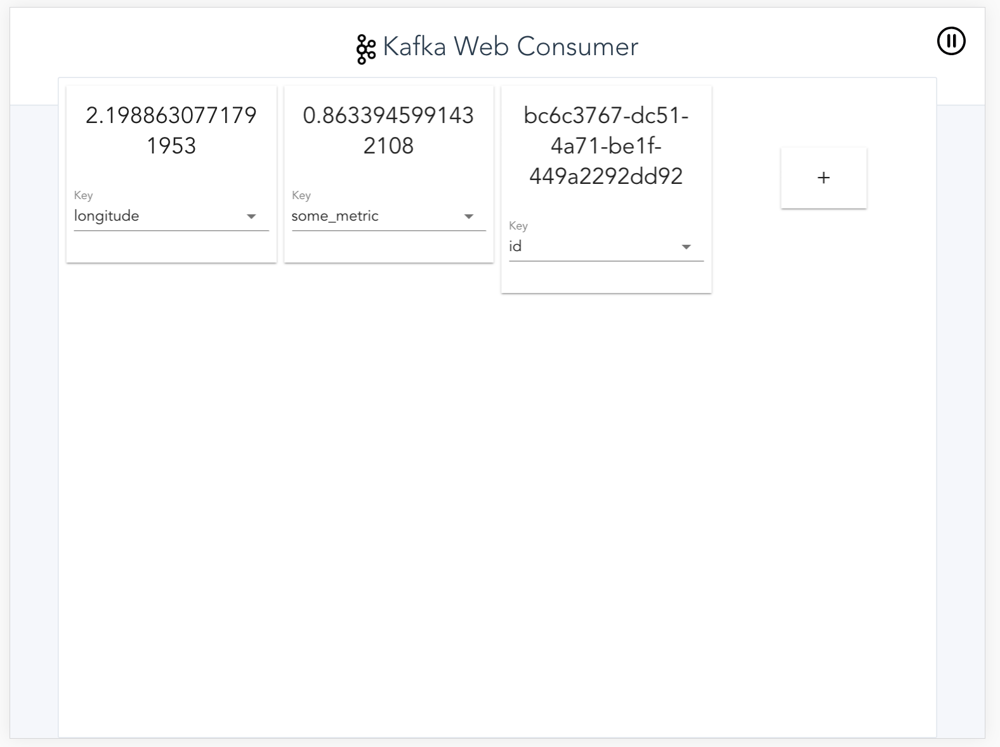
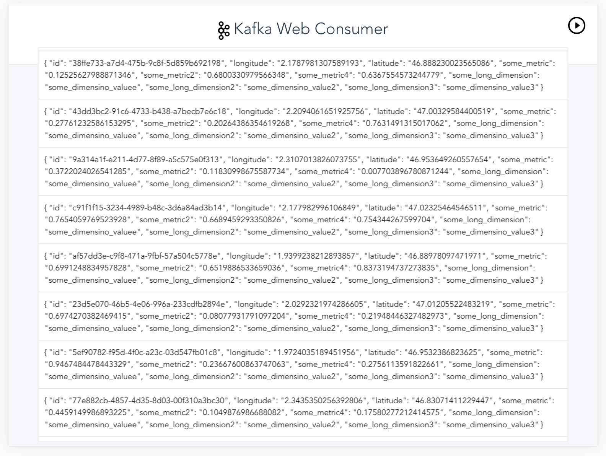
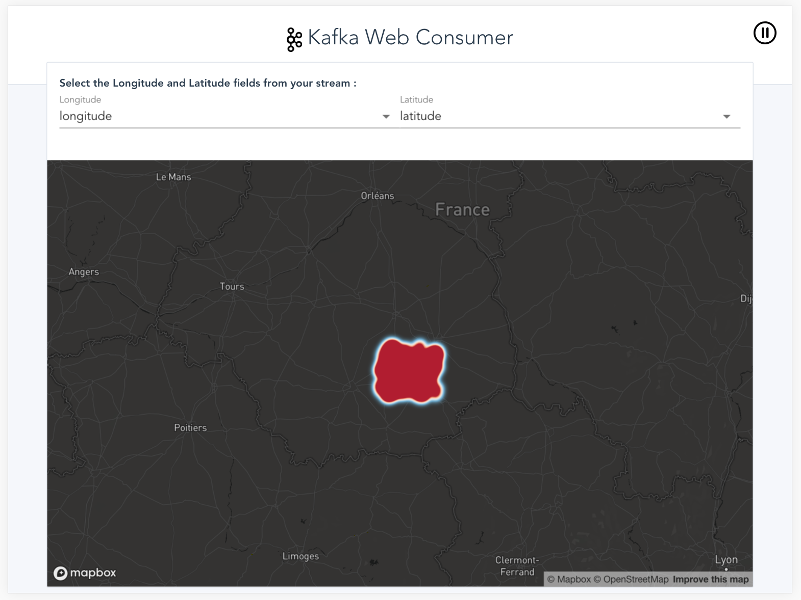
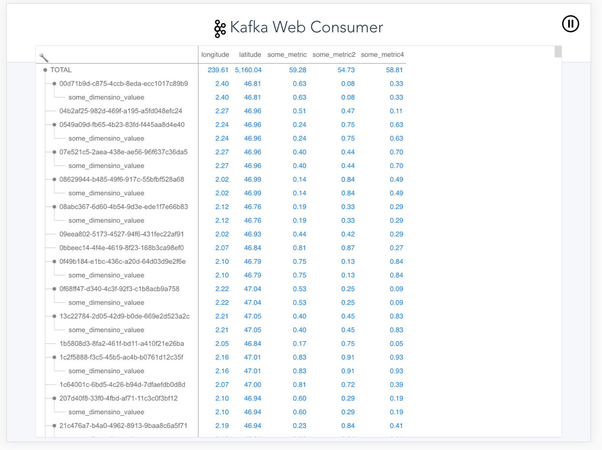
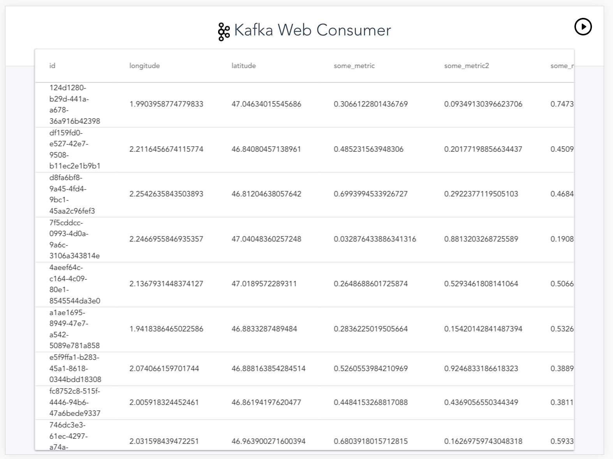

```
 _          __ _                           _
| | ____ _ / _| | ____ _     __      _____| |__         ___ ___  _ __  ___ _   _ _ __ ___   ___ _ __
| |/ / _` | |_| |/ / _` |____\ \ /\ / / _ \ '_ \ _____ / __/ _ \| '_ \/ __| | | | '_ ` _ \ / _ \ '__|
|   < (_| |  _|   < (_| |_____\ V  V /  __/ |_) |_____| (_| (_) | | | \__ \ |_| | | | | | |  __/ |
|_|\_\__,_|_| |_|\_\__,_|      \_/\_/ \___|_.__/       \___\___/|_| |_|___/\__,_|_| |_| |_|\___|_|

```
The kafka web consumer is a tool that reads data from Kafka and display them in a web UI.

## Table of contnent
- [How To Use](#how-to-use)
- [Configuration](#Configuration)
- [Components](#Components)
    - [Cards](#Cards)
    - [List](#List)
    - [List](#List)
    - [Map](#Map)
    - [Pivot](#Pivot)
    - [Table](#Table)

## HOW TO USE:
```
usage: kafka-web-consumer
 -b,--bootstrap-server <arg>   REQUIRED: The server to connect to.
 -bs,--buffer-size <arg>       Size of the buffer on the UI.
 -c,--component <arg>          REQUIRED: Client component viewer [cards,
                               list, map, pivot, table].
 -fb,--from-beginning          If the consumer does not already have an
                               established offset to consume from, start
                               with the earliest message present in the
                               log rather than the latest message
 -h,--help                     Prints this message.
 -p,--port <arg>               Port on which will start Kafka-Web-Consumer
 -t,--topic <arg>              REQUIRED: The topic id to consume on.
```

## Configuration
The configuration file, needed for the [Map Component](#Map), must be created in the `$HOME` folder with the name `.kwc`.

It uses the [HOCON format](https://github.com/lightbend/config/blob/master/HOCON.md).


## Components

### Cards
The cards component display the data . You must select the key from the data for every card.

Screenshot:


### List
The list component display the raw data.

Screenshot:


### Map
This components uses on The mapbox WebGL component. As it relies on MapBox, you will need a `access-token` (You can create one here).
The `access-token` must be saved into the the [configuration file](#configuration) as the following:
```
mabox {
    access-token: "MY_ACCESS_TOKEN_FROM_MAPBOX"
}
```

Screenshot:



### Pivot
This component uses the Perspective library from JPMorgan And Chase : https://jpmorganchase.github.io/perspective

Screenshot:


### Table
The table component displays the data into a table. Columns are automatically mapped from the data.

Screenshot:
